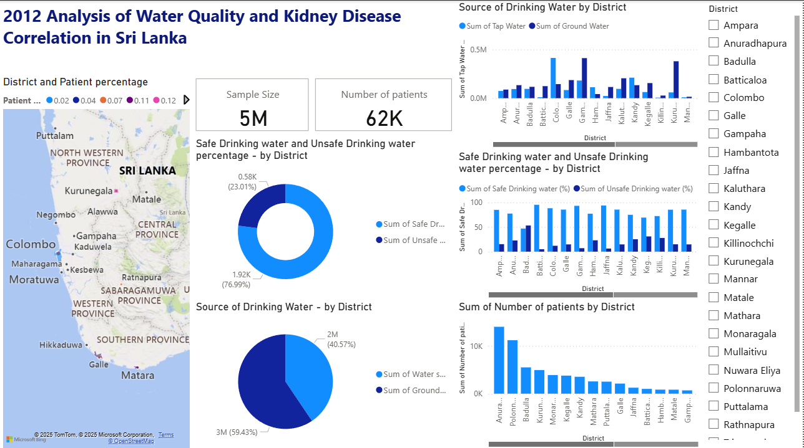

# 🩺 Analysis of Chronic Kidney Disease and Water Sources in Sri Lanka (2012)

## 📘 Project Overview
This project analyzes the relationship between **kidney disease prevalence** and **water sources** across districts in Sri Lanka using 2012 data.  
The goal is to identify patterns between the use of **groundwater** and the incidence of **chronic kidney disease (CKD)**, providing insights into potential environmental and regional risk factors.

---

## 📂 Dataset Description
The dataset includes information from Sri Lankan districts, covering:

| Column | Description |
|:--|:--|
| **District** | Name of the administrative district |
| **Population** | Total population in 2012 |
| **Kidney Patients** | Number of reported kidney disease cases |
| **Tap Water Usage (%)** | Percentage of population using tap water |
| **Groundwater Usage (%)** | Percentage of population using groundwater |
| **Other Sources (%)** | Percentage using other water sources |

---

## 🧠 Key Insights
- Districts with **higher groundwater dependency** show a **greater number of kidney disease cases**.  
- **North Central** and **Uva** provinces record the **highest prevalence**.  
- Access to **safe tap water** correlates with **lower disease rates**.  
- Results highlight the importance of **clean water access and water quality monitoring**.

---

## 📊 Tools & Technologies
- **Python / Jupyter Notebook** → Data cleaning and exploration  
- **Pandas**, **Matplotlib**, **Seaborn** → Statistical analysis and visualizations  
- **Power BI** → Interactive dashboard and regional insights  

---

## 📈 Visualizations Created
- 🗺️ **Map View:** District-wise patient percentage and water source distribution.  
- 🍩 **Donut Charts:** Safe vs. unsafe drinking water ratio by district.  
- 📊 **Bar Charts:**  
  - Sources of drinking water (tap vs. ground).  
  - Safe and unsafe water percentage by district.  
  - Number of kidney patients by district.  
- 🔢 **KPI Cards:** Sample Size (**5M**) and Total Patients (**62K**).  
- 🎛️ **Interactive Filters:** Select districts to explore detailed regional trends.



---

## 🧾 Dataset Information

The following datasets were used in this analysis:

- [`Kidney.csv`](Kidney.csv)  
- [`source_of_drinking_water_in_rural_sector_1_1.csv`](source_of_drinking_water_in_rural_sector.csv)  
- [`drinking_water_sources_available_2012_0.csv`](drinking_water_sources_available_2012.csv)

**Source:** [Kaggle](https://www.kaggle.com/)  
**Data Preparation:** Cleaned and formatted using **Microsoft Excel** before importing into **Power BI**.

---

## ⚙️ How to Use This Project

1. **Clone the repo**
   ```bash
   git clone https://github.com/Janith-Chathuranga/Kidney-Disease-Analysis-SriLanka.git

2. Open the .pbix file included in the repository

3. Review DAX measures, parameter slicers, and visualizations

 4. (Optional) Replace datasets with updated or local data to extend the analysis

---

## 📄 **License**

This project is shared for educational and portfolio purposes.
Please ensure compliance with the Kaggle dataset license if republishing or using it commercially.

---

## 🚀 Outcome
The study reveals a strong link between **groundwater consumption** and **CKD prevalence**, emphasizing the need for improved **water quality management** and **public health awareness** in vulnerable regions of Sri Lanka.

---

👨‍💻 **Created by**

Janith Chathuranga
📍 ICT Undergraduate | Data Enthusiast | Power BI Develope


